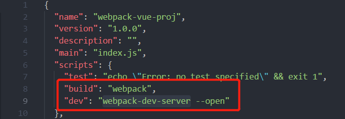
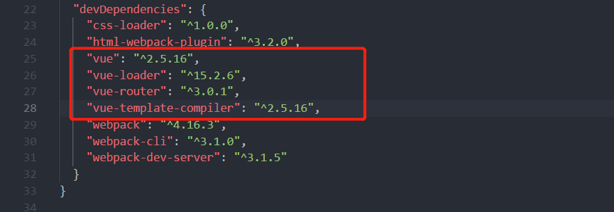
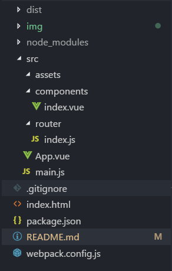
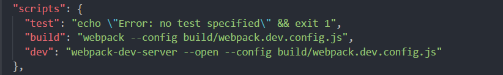
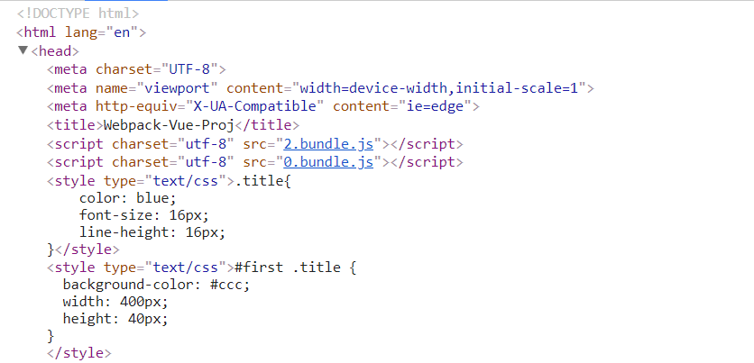
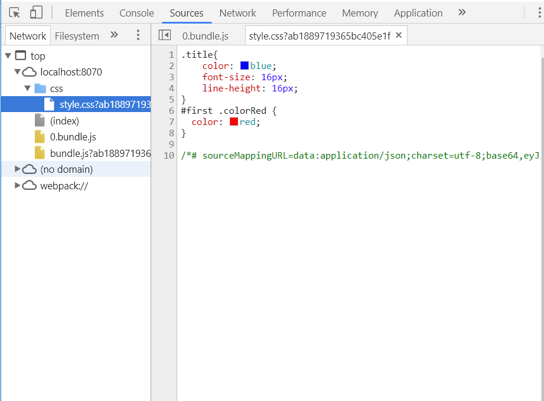

# webpack-vue-proj

## 什么是webpack？

webpack可以看作是一个模块打包器，webpack会从一个入口文件分析你的项目的依赖，处理你的依赖，转换为浏览器可运行的代码。

## webpack是基于node的

在项目的根目录下创建webpack.config.js的文件，执行webpack命令时会默认读取这个配置文件。

```js
//webpack.config.js
module.exports = {
    entry:'',//入口文件(可配置多入口文件)
    output:{},//出口文件
    module:{},//处理相应的模块
    plugins:[],//插件模块
    devserver:{},//服务器配置模块
    mode:"development",//打包模式(development or production)
}
```

## 最简单的webpack配置

下面来看一下最简单的webpack配置

```js
//webpack.config.js
conts path = require('path');//node自带处理文件路径模块

module.exports = {
    entry:'./src/main.js',//入口文件，webpack会从这个文件来分析项目依赖
    output:{
        filename:'bundle.js',//打包后的文件的名称
        path:path.resolve('dist')//打包后输出的位置
    }
}
```
在vue中我们都会通过npm run dev来开启服务器，npm run build来打包文件，那么我们就需要在package.json文件中配置命令行。



执行npm run dev时，我们需要安装通过npm install webpack-dev-server --save-dev 来安装这个npm包,安装完成后就可以启动一个服务器，在线预览我们的项目。

执行npm run build后，就执行打包命令生成了一个dist文件夹。

## 配置vue的开发环境

需要安装一下几个npm包:



目录结构如下(参考项目文件夹)：



我们需要在webpack.config.js中配置可处理.vue后缀的文件

```js
const path = require('path');
const VueLoaderPlugin = require('vue-loader/lib/plugin');
module.exports={
    ...
    module:{
        rules:[
            //处理.vue后缀的文件
            {
                test:/\.vue$/,
                use:['vue-loader']
            }
        ]
    },
    plugins:[
        new VueLoaderPlugin();//vue-loader v15+需要配合这个插件一起使用
    ]
    ...
}
```

随后配置main.js，App.vue，router下的index.js和添加components组件后，执行npm run dev，开启webpack服务器后就看到效果。

## 配置开发环境和生产环境

我们在使用vue-cli生成的项目中，可以看到webpack.base.config.js，webpack.dev.config.js和webpack.prod.config.js，这三个文件分别对应的是开发环境和生成环境共同的配置，开发环境的配置，生产环境的配置。需要我们在package.json命令行中指定为我们需要用哪个配置文件。



因为开发环境和生产环境有共同的配置，所以我们可以使用webpack-merge去合并(npm install webpack-merge --save-dev);

其实一旦开启了 mode:'production'，会自动开启代码压缩、scope hoist 等插件，以及自动传递环境变量给 lib 包，所以已经不需要 plugins 这个配置项了。同理，开启了 mode:'development' 会自动开启 sourceMap 等开发插件，我们只要关心更简单的配置，这就是 4.0 零配置的重要改变。

### 开发环境

开发环境主要配置webpack-dev-server

```js
//webpack.dev.conf.js
const baseConf = require('./webpack.base.conf');
const merge = require('webpack-merge');
const path = require('path');
const webpack = require('webpack');
const dev = {
    devServer:{
        contentBase:path.resolve(__dirname,'./dist'),
        port:8070,
        host: 'localhost',//设置为localhost时只能在本机访问。可改为0.0.0.0
        overlay: true,
        compress: true,
        open:true,
        hot: true,
        inline: true,
        progress: true,
    },
    plugins:[
        new webpack.HotModuleReplacementPlugin(),
        new webpack.NamedModulesPlugin(),
    ],
    devtool:'inline-source-map',
    mode:'development'
}

module.exports = merge(baseConf,dev);
```

### 生产环境

主要为生产环境配置了压缩混淆的插件

```js
//webpack.prod.confi.js
const merge = require('webpack-merge');
const baseConf = require('./webpack.base.conf');
const UglifyJsPlugin = require('uglifyjs-webpack-plugin');//混淆压缩
const prod={
    opimization:{
        minimizer:[
            new UglifyJsPlugin()
        ]
    },
    mode:'production'
}
module.exports = merge(baseConf,prod);
```

## Loader

由于webpack自身只能了解js文件，所以webpack需要loader去处理比如.vue,.css.png格式的文件。loader可以讲所有类型的文件转换为webpack能够处理的有效模块。
loader有两个重要的目标：

1. test属性:用于标识出应该被对应loader进行转换的某个或某些文件；
2. use属性:用于标识再进行转换时，应该使用什么loader。

比如之前我们用于处理.vue文件的loader：vue-loader

```js
// ./build/webpack.base.conf.js
...
    module:{
        rules:[
            {
                test:/\.vue$/,
                use:['vue-loader']
            }
        ]
    }
...
```

### 处理css文件的loader

安装两个loader css-loader style-loader，如果需要引入less文件的话，需要安装less-loader

```sh
npm install css-loader style-loader less less-loader -D
```
下面就是配置loader

```js
...
    module:{
        rules:[
            {
                test:/\.vue$/,
                use:['vue-loader']
            },
            {
                test:/\.css$/,
                use:['style.loader','css-loader']
            }
        ]
    },
...
```

这种方式打包后的文件是内嵌到html里面的style样式，我们需要将css提取出来形成单独的文件。



拆分css 我们就需要extract-text-webpack-plugin这个插件，先安装一下这个插件；

```js
//@next 表示可支持webpack4版本的插件
npm install extract-text-webpack-plugin@next -D
```

接下来配置插件：

```js
// .build/webpack.base.conf.js
const ExtractTextWebpackPlugin = require('extract-text-webpack-plugin');

modules:{
    rules:[
        //支持css
        {
            test:/\.css$/,
            use:ExtractTextWebpackPlugin.extract({
                use:['css-loader?minimize'],//这种方式引入css文件就不需要style-loader了
            })
            //use:['style-loader','css-loader']//从右往左解析
        },
        {
            test:/\.less$/,
            use:ExtractTextWebpackPlugin.extract({
                use:['css-loader?minimize','less-loader'],
            })
            //use:['style-loader','css-loader','less-loader'],//
        }
    ]
},
plugins:[
    new ExtractTextWebpackPlugin({
        filename:'css/style.css'，
        // Setting the following option to `false` will not extract CSS from codesplit chunks.
        // Their CSS will instead be inserted dynamically with style-loader when the codesplit chunk has been loaded by webpack.
        // It's currently set to `true` because we are seeing that sourcemaps are included in the codesplit bundle as well when it's `false`, 
        // increasing file size: https://github.com/vuejs-templates/webpack/issues/1110
        allChunks: true,
    })
]

```

然而对于.vue 文件，光是这样设置是不能提取css文件的，还需要如下的设置,在处理.vue的文件中设置提取css,less的插件:

```js
// ./build/webpack.base.confi.js
 module:{
        rules:[
            {
                test:/\.vue$/,
                use:{
                    loader:"vue-loader",
                    options:{
                        loaders:{
                            css:ExtractTextWebpackPlugin.extract({
                                use:'css-loader'
                            }),
                            less: ExtractTextWebpackPlugin.extract({
                                use: ["css-loader", "less-loader"]
                            })
                        }
                    }
                }
            },
        ]
    },
```

运行 npm run dev后，打包后的文件css文件就被单独打包到style.css的文件中去了。



完整的webpack.base.conf.js在根目录下的build文件夹下。

### 支持图片和相应的字体

安装处理相应图片和字体的loader

```sh
cnpm install url-loader file-loader -D
```

配置图片及图标字体对应的 loader。

```js
// 
module:{
    rules:[
        {
            test: /\.(png|jpe?g|gif|svg)(\?.*)?$/,
            use: [{
                loader: "url-loader",
                options: {
                    limit: 10000,
                    name: 'images/[name].[hash:7].[ext]'    // 将图片都放入 images 文件夹下，[hash:7]防缓存
                }
            }]
        },
        {
            test: /\.(woff2?|eot|ttf|otf)(\?.*)?$/,
            use: [{
                loader: "url-loader",
                options: {
                    limit: 10000,
                    name: 'fonts/[name].[hash:7].[ext]'    // 将字体放入 fonts 文件夹下
                }
            }]
        }
    ]
}

```

### 转义ES6

我们使用babel插件来讲es6转义成es5，先安装这些插件：

```sh
npm i babel-core babel-loader babel-preset-env babel-preset-stage-0 -D

```

最好在根目录下新建一个.babelrc的文件来单独配置.

```js
    // ./build/webpack.base.conf.js
    {
        test: /\.js$/,
        use: {
            loader:"babel-loader"
        },
        include: [path.resolve(__dirname,'..', 'src')] //表示只解析src文件夹
    }
    //Webpack 建议尽量避免 exclude，更倾向于使用 include。

    // .babelrc 
    {
        "presets": [
            ["env", { "modules": false }]
        ],
        "comments": false
    }
```

由于本项目安装了vuex，vuex依赖于promise，所以我们需要 babel-polyfill，先安装插件。

```sh
cnpm install babel-polyfill -save-d
```
然后需要在入口文件中做一些配置
```js
entry: {
    app: ["babel-polyfill",'./src/main.js']//vuex依赖于promise，所以需要babel-polyfill
},
```
详情可参考 [点击这里](http://www.licongwen.com/2018/02/05/vue%E5%9C%A8Android4-4-2%E7%89%88%E6%9C%AC%E4%B8%8B%E5%85%BC%E5%AE%B9%E6%80%A7%E9%97%AE%E9%A2%98%E8%A7%A3%E5%86%B3/)

### 切割代码

当打包出来的代码文件过大时，会影响我们的加载速速，这个时候就需要我们将过大的代码进行分割。

### Pluging


